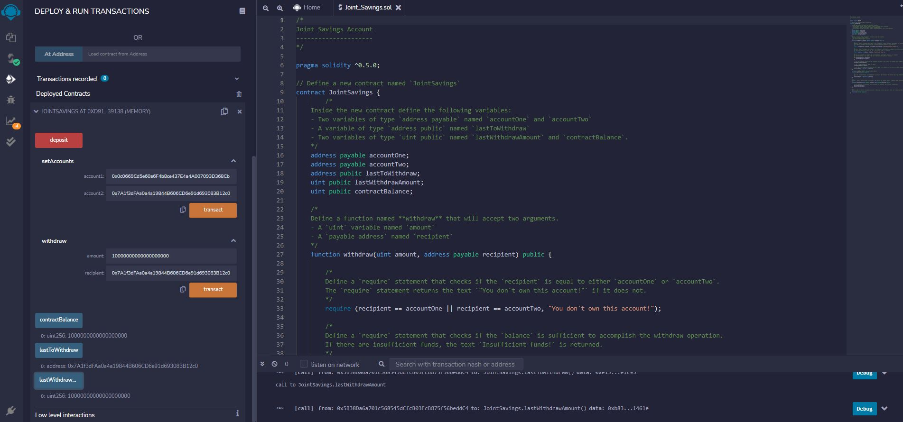

# Smart Contracts

## Analysis

Within this repository is a Smart Contract created for a Joint Savings account between two parties.  This contract has several built in functions including: Add Accounts, Deposit, Withdraw, View Balance, View Last To Withdraw, View Last Withdraw Amount.  All of these functions will help to keep the account balance secure and in the correct pair of hands.  Below are screenshots of the contracts functionality, code and screenshots are held in the files above.

-----

## Functionality

Adding the accounts to the contract

--------

Depositing 1 Ether as Wei

Depositing 10 Ether as Wei

Depositing 5 Ether

-------

Withdrawing 5 Ether from the account to a personal account, and showing the transaction amount and recipient

Withdrawing 10 Ether from the account to a second personal account, and showing the transaction amount and recipient
